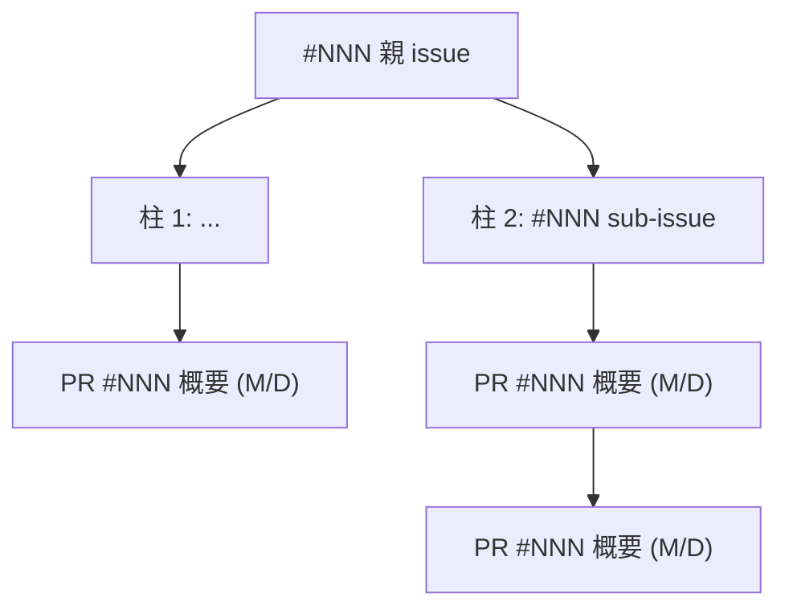

# 週次進捗報告の生成

リポジトリの PR / issue から「何を・なぜ・どこまで進めたか」を再構成し、報告用 md を生成する。
PR タイトルの羅列ではなく、背景を知らない読み手 (報告相手) が流れを掴めるストーリーにすることが目的。

## 前提

- カレントが GitHub remote を持つ git リポジトリであること
- `gh` が認証済みであること (未認証なら `gh auth status` で確認し `gh auth login` を案内)

## 手順

### 1. 期間の決定

優先順:

1. ユーザーが明示した期間 (「6/6 以降」、引数の日付など)
2. `tmp/weekly/*.md` の最新ファイル名の日付 (`YYYY-MM-DD.md`)。前回報告との漏れ・重複を防ぐため
3. どちらもなければ 7 日前 (collect.sh のデフォルト)

### 2. データ収集 (一覧)

収集スクリプトを実行する (gh の落とし穴を封じてあるので必ずこれを使う):

```bash
bash ~/.claude/skills/weekly-report/scripts/collect.sh [SINCE]   # SINCE は YYYY-MM-DD、省略可
```

出力は `REPO=` / `SINCE=` / `UNTIL=` のメタ情報に続き、`===MERGED_PRS===` (期間内マージ、author 不問)、`===OPEN_PRS===` (draft 含む)、`===OPEN_ISSUES===` の JSON 配列。

スクリプトが落ちた場合 (gh 未認証・GitHub remote 無し等) は原因を切り分けてユーザーに伝え、中断する。

### 3. 深掘り (ここが報告の質を決める)

一覧だけで書くとタイトルの羅列にしかならない。本文と参照先を辿る:

```bash
# 本人のマージ済み PR + 作成中 PR の本文を一括取得
for n in <番号...>; do gh pr view $n --json number,title,body,mergedAt,baseRefName,headRefName; done
```

- PR 本文の `Resolves #X` / `Refs #X` / 「親 issue」を `gh issue view` で辿る。計画・ロードマップはここに書かれていることが多く、「総論 > 直近の計画」の一次ソースになる
- PR が参照する issue コメント (検証結果・最終報告など) を `gh api repos/<owner>/<repo>/issues/comments/<id>` で取得する。before/after の数字はここから transcribe する。記憶や推測で数字を書かない
- OPEN_ISSUES は「今後やること」の材料に使い、実質完了なのに open のままの issue (状態と実態の乖離) も検出する

### 4. ストーリーの組み立て

- 主役はユーザー本人の PR。bot (dependabot 等) や期間外から放置されている draft は 1 行に圧縮する。ゼロにすると「見落とした」ように見えるため、消すのではなく圧縮する
- PR を時系列でなくテーマ (柱) でグルーピングする。多くの場合、親 issue が柱に対応する
- 各柱は「課題 → やったこと → 結果」の順で書く。課題を先に書かないと、読み手には変更の必然性が伝わらない
- 効果が数字で取れるもの (before/after、件数、率) は表にする。報告の説得力は数字が担う
- PR の base ブランチを確認する。PR 同士が積み重なっている場合 (feature ブランチへマージ → まとめて統合等) は図で統合関係として表す

### 5. レポート生成

下のテンプレートに従う。総論が最重要 — 忙しい読み手は総論しか読まない前提で、総論だけで報告として成立させる。

- 直近の計画: この期間に何を目指していたか。issue / ロードマップから
- 目に見える変更: ステークホルダーから観測可能な変化 (UI の変化・品質数値の改善など)。内部リファクタはここに入れない
- 今後やること: 短期 (作成中 PR の残作業、クローズ漏れ issue) と中期 (次の方針) を並べる

### 6. 保存と報告

- `tmp/weekly/YYYY-MM-DD.md` (当日日付) に保存。`mkdir -p tmp/weekly` してから書く
- `git check-ignore tmp/weekly/<file>` で gitignore 対象か確認し、対象外ならユーザーに知らせる (リポジトリを汚さないため)
- 会話側ではレポートの要約に加えて、収集中に見つけた気づき (実質完了なのに open の issue、PR と issue の不整合など) を補足する。レポート本文は報告相手向け、気づきはユーザー向けと分ける

## レポートテンプレート

````markdown
# 進捗報告 YYYY-MM-DD 〜 YYYY-MM-DD

## 総論

### 直近の計画
- (この期間の主軸。親 issue 番号を添える)
- (柱が複数あれば柱ごとに 1 行)

### 目に見える変更
- (観測可能な変化。数字が出せるものは「X → Y」形式で)

### 今後やること
- (短期: 作成中 PR の残作業)
- (中期: 次の方針)

## 全体の流れ



## マージ済み PR

| PR | マージ日 | 内容 |
|---|---|---|
| #NNN | M/D | (1 行サマリ) |
| #NNN #NNN | M/D | dependabot (パッケージ名) |

### 柱 1: (テーマ名)

- 課題: (なぜこの仕事が必要だったか)
- (やったこと。要点を 2-4 行)
- (結果。数字があれば表)

### 柱 2: (テーマ名)

(同上)

## 作成中の PR

### #NNN タイトル (draft)

- (背景と内容を 2-3 行)
- 残: (ready までに何が必要か)

その他 open PR: (bot や期間外 draft を 1 行で)
````

## 文体

成果物 md は以下に従う (会話の応答スタイルとは別ルール):

- 箇条書き中心。体言止めで短く、1 項目 1 行
- 敬語不要
- bold 不使用 (見出し `##` `###` は可)
- 前置き・締めの挨拶なし
- 構造・経路・依存関係は文章で説明せず mermaid で示す
- 表は短い列挙事実 (PR 一覧、数値比較) のみに使う
